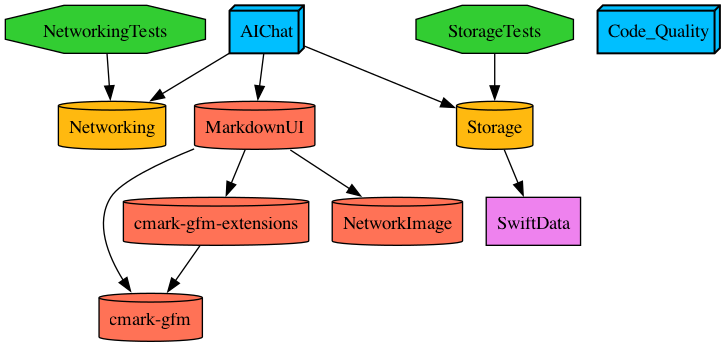

# AIChat

AIChat is a macOS application built with SwiftUI that provides a chat interface for AI-powered conversations.


## Features

- Chat interface for conversations with AI
- Sidebar for navigation
- Settings screen to customize the application
- Multiple chat sessions support

## Project Structure

The project is organized into the following modules:

- **AIChat**: Main application module containing the UI and app logic
- **Networking**: Network layer module for API communications
- **Storage**: Data persistence module using SwiftData

## Project Architecture

The project uses a modular architecture with separate modules for different concerns. The following graph shows the project dependencies and structure:



*This dependency graph is generated using the `tuist graph` command, which visualizes the relationships between different modules and targets in the project.*

### Graph Legend

**Colors:**
- **Blue**: Application and utility targets (AIChat, Code_Quality)
- **Yellow (#FFB90D)**: Framework/library targets (Networking, Storage)
- **Green**: Test targets
- **Orange (#FF7256)**: External UI dependencies (MarkdownUI and its dependencies)
- **Purple**: System frameworks (SwiftData)

The graph helps visualize the project's modular structure and ensures clean separation of concerns between different layers of the application.

## Requirements

- macOS
- Xcode 15.0+
- Swift 5.9+
- iOS 17.0+ / macOS 14.0+

## Installation

### Prerequisites

Install Tuist using mise:
```bash
mise install tuist
```

### Setup

1. Clone this repository
2. Install dependencies:
   ```bash
   tuist install
   ```
   *This command installs all Swift Package Manager dependencies defined in the project.*

3. Generate the Xcode project:
   ```bash
   tuist generate
   ```
   *This command generates the Xcode project and workspace files based on the Tuist configuration.*

4. Open `AIChat.xcworkspace` in Xcode
5. Build and run the application

## Development

### Code Quality

The project maintains high code quality standards with automated tools and processes:

- **Code Coverage Target**: 80% minimum coverage for all production code
- **Code Formatting**: Swift Formatter ensures consistent code style
- **Linting**: SwiftLint enforces coding standards and best practices
- **Automated Fixes**: `swiftlint fix` automatically corrects common issues
- **Dead Code Detection**: SwiftLint identifies unused code and imports
- **Architecture Validation**: `tuist graph` generates dependency graphs to visualize and validate project structure

### Tools
- **Swift Formatter** for consistent code formatting
- **SwiftLint** for code style enforcement and issue detection
- **XCTest** for unit and UI testing
- **SwiftUI** for UI development
- **Tuist** for project generation and dependency management

### Best Practices
- MVVM Architecture
- Unit tests for business logic
- UI tests for critical user flows
- SwiftLint rules enforced
- Regular code reviews and quality checks

## License

This project is licensed under the MIT License - see the [LICENSE](LICENSE) file for details.

## Code Coverage


AIChat maintains a code coverage target of 80% for all production code. Code coverage reports are generated during the CI/CD pipeline runs.

## Author

Created by ENNBOU
